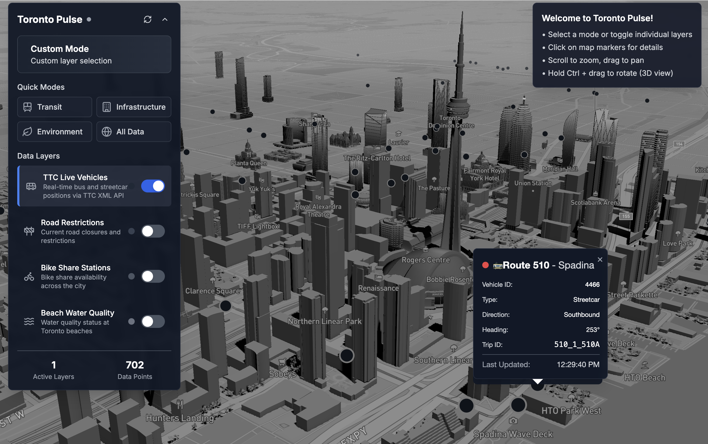

# Toronto Pulse 🏙️

A modern, interactive 3D city dashboard for Toronto built with React, TypeScript, and Mapbox GL JS. Toronto Pulse visualizes real-time urban data including public transit, road conditions, bike share availability, and environmental metrics in an immersive 3D interface.

**Now featuring complete CORS resolution, XML API support, real-time health monitoring, true "one-command, zero-issues" data integration, and an AI-powered city data assistant!**



## 🤖 AI City Assistant

Toronto Pulse now includes an intelligent AI assistant that can answer questions about Toronto city data using natural language. Ask about transit, infrastructure, events, or any city data and get real-time, data-driven responses.


### AI Features
- **Natural Language Queries**: Ask questions in plain English about Toronto city data
- **Real-Time Data Integration**: Uses live data from all 6+ integrated data sources
- **Smart Query Analysis**: Automatically determines relevant data sources based on your question
- **Location-Based Filtering**: Finds data for specific streets, areas, or neighborhoods
- **Intelligent Summaries**: Provides detailed, contextual responses with actual data
- **Follow-Up Suggestions**: Offers related questions to explore more data

     

## 🚀 Features

### 🤖 AI-Powered City Assistant
- **Natural Language Interface**: Ask questions about Toronto city data in plain English
- **Real-Time Data Analysis**: Get instant insights from live municipal data
- **Smart Query Processing**: Automatically finds relevant data sources for your questions
- **Location-Aware Responses**: Ask about specific streets, neighborhoods, or areas
- **Multi-Source Integration**: Combines data from transit, infrastructure, and environmental sources
- **Interactive Follow-Ups**: Suggests related questions to explore more city data

### Real-Time Data Visualization
- **TTC Live Vehicles**: Track buses and streetcars in real-time
- **Road Restrictions**: View current road closures and construction zones
- **Red Light Cameras**: Monitor automated red light enforcement locations across intersections
- **Speed Enforcement Cameras**: Track automated speed enforcement system locations
- **Bike Share Stations**: Monitor bike availability across the city
- **Beach Water Quality**: Check environmental conditions at Toronto beaches

### Interactive Experience
- **3D City View**: Immersive 3D perspective with tilt and rotation controls
- **Multi-Mode Dashboard**: Switch between Transit, Infrastructure, Environment, and All Data views
- **Layer Management**: Toggle individual data layers on/off
- **Real-Time Updates**: Automatic data refresh at optimized intervals
- **Click Interactions**: Get detailed information by clicking on map features

### Modern UI/UX
- **Dark Theme**: Sleek, modern interface optimized for data visualization
- **Responsive Design**: Works across desktop and mobile devices
- **Smooth Animations**: Fluid transitions and interactive feedback
- **Accessibility**: Built with accessibility best practices

### 🆕 Developer Experience & CLI Tools (Phase 5 - Complete)
- **Plugin-Based Architecture**: Modular, domain-driven data source plugins
- **CLI Toolkit**: Comprehensive command-line tools with health monitoring
- **Auto-Generation**: Generate complete data source plugins with automatic CORS prevention
- **Real-Time Health Monitoring**: Live dashboard showing all plugin status (5/5 healthy)
- **XML API Support**: Full support for TTC Live Vehicles and other XML APIs
- **CORS Auto-Fix**: One-command resolution for all CORS issues
- **Browser Validation**: Comprehensive testing for browser compatibility
- **Type Safety**: Full TypeScript coverage with automatic type generation

## 🛠️ Tech Stack

### Core Technologies
- **Frontend**: React 18, TypeScript
- **Mapping**: Mapbox GL JS, React Map GL
- **AI Integration**: Anthropic Claude API for natural language processing
- **Styling**: Tailwind CSS, Lucide React Icons
- **Data Processing**: Turf.js for geospatial operations
- **Build Tool**: Vite
- **HTTP Client**: Axios

### 🆕 Development & Testing
- **Testing**: Vitest with jsdom environment
- **CLI Framework**: Commander.js with interactive prompts
- **Code Generation**: Automated plugin scaffolding
- **Validation**: Zod for runtime type validation
- **TypeScript**: Strict mode with comprehensive type coverage

### Data Sources
- **Toronto Open Data Portal**: Public datasets and APIs
- **TTC Real-Time Feed**: Live vehicle positions
- **Mapbox**: Base map tiles and geospatial services

## 📋 Prerequisites

- Node.js 18+ and npm
- Mapbox access token (free tier available)
- Anthropic API key (for AI Assistant - optional)

## 🚀 Quick Start

1. **Clone the repository**
   ```bash
   git clone https://github.com/raztronaut/torontopulse.git
   cd torontopulse
   ```

2. **Install dependencies**
   ```bash
   npm install
   ```

3. **Set up environment variables**
   Create a `.env` file in the root directory:
   ```env
   VITE_MAPBOX_TOKEN=your_mapbox_access_token_here
   VITE_ANTHROPIC_API_KEY=your_anthropic_api_key_here
   ```
   
   **Required:**
   - Get your free Mapbox token at: https://account.mapbox.com/access-tokens/
   
   **Optional (for AI Assistant):**
   - Get your Anthropic API key at: https://console.anthropic.com/

4. **Start the development server**
   ```bash
   npm run dev
   ```

5. **Open your browser**
   Navigate to `http://localhost:5173`

## 🎮 How to Use

### Navigation Controls
- **Zoom**: Mouse wheel or pinch gestures
- **Pan**: Click and drag
- **3D Rotation**: Hold Ctrl/Cmd + drag
- **Tilt**: Hold Shift + drag

### Dashboard Modes
- **Transit**: Focus on public transportation and bike sharing
- **Infrastructure**: View road conditions, construction, traffic enforcement cameras, and speed cameras
- **Environment**: Monitor environmental data like beach water quality
- **All Data**: Display all available layers simultaneously
- **Custom**: Manual layer selection mode

### Layer Controls
- Toggle individual layers using the sidebar controls
- Refresh data manually using the refresh button
- Expand/collapse the control panel for better map viewing

### 🤖 AI Assistant Usage
- **Access**: Click the "AI Assistant" button in the bottom-right corner
- **Ask Questions**: Type natural language questions about Toronto city data
- **Example Queries**:
  - "What TTC vehicles are running on King Street?"
  - "Show me bike share stations downtown"
  - "Are there any road closures affecting the 501 Queen route?"
  - "What's the water quality like at Toronto beaches?"
- **Follow-Up**: Use suggested follow-up questions to explore related data
- **Data Sources**: Responses include which data sources were used

## 🆕 CLI Tools & Plugin Development

Toronto Pulse features a powerful CLI toolkit for rapid data source development with **automatic CORS resolution** and **one-command integration**:

### Quick Start
```bash
# Generate a new data source plugin (automatic CORS prevention)
npm run tp generate:datasource

# Check health of all plugins
npm run tp health

# Test a specific plugin
npm run tp test:datasource ttc-vehicles --validate
```

### Auto-Generation Features
- **One-Command Integration**: Complete plugin generation from URL to working browser layer
- **Automatic CORS Prevention**: No manual proxy configuration needed
- **XML & JSON API Support**: Handles TTC Live Vehicles XML and Toronto Open Data JSON APIs
- **Real-Time Health Monitoring**: Live dashboard showing plugin status and performance
- **Type Safety**: Full TypeScript coverage with automatic type generation

### Plugin Generation Example
```bash
npm run tp generate:datasource \
  --name="Traffic Signals" \
  --domain="infrastructure" \
  --url="https://ckan0.cf.opendata.inter.prod-toronto.ca/api/3/action/datastore_search"

# Result: Complete, working plugin with zero manual fixes required! 🎉
```

**Current Status**: 7/7 plugins healthy with automatic CORS resolution

📚 **For complete CLI documentation and advanced features, see [CLI-Documentation.md](./CLI-Documentation.md)**

## 🗂️ Project Structure

```
torontopulse/
├── src/
│   ├── app/                    # Application layer
│   │   ├── hooks/             # Custom React hooks
│   │   └── store/             # Global state management
│   ├── components/            # React UI components
│   │   └── AIQueryPanel.tsx   # 🤖 AI Assistant interface
│   ├── config/               # Configuration files
│   │   └── ai.ts             # 🤖 AI configuration
│   ├── core/                 # 🆕 Core framework
│   │   ├── ai/               # 🤖 AI query processing
│   │   ├── data-sources/     # Plugin system infrastructure
│   │   ├── cache/            # Caching strategies
│   │   ├── mapbox/           # Map rendering utilities
│   │   ├── ui/               # Shared UI components
│   │   └── utils/            # Utility functions
│   ├── domains/              # 🆕 Business domain plugins
│   │   ├── transportation/   # Transit and mobility data
│   │   ├── infrastructure/   # Roads, traffic enforcement, and city infrastructure
│   │   │   ├── red-light-cameras/           # Red light camera locations
│   │   │   ├── automated-speed-enforcement/ # Speed enforcement camera locations
│   │   │   └── road-restrictions/           # Road closures and construction
│   │   ├── environment/      # Environmental data
│   │   └── events/           # City events and emergencies
│   ├── infrastructure/       # 🆕 External integrations
│   │   ├── apis/             # API clients and adapters
│   │   ├── config/           # Environment configuration
│   │   └── monitoring/       # Health checks and metrics
│   ├── tools/                # 🆕 CLI and development tools
│   │   ├── cli/              # Command-line interface
│   │   ├── generators/       # Code generation utilities
│   │   └── validators/       # Data validation tools
│   ├── services/             # Legacy data services
│   ├── hooks/                # React hooks
│   ├── types/                # TypeScript definitions
│   ├── App.tsx               # Main application component
│   ├── main.tsx              # Application entry point
│   └── index.css             # Global styles
├── public/                   # Static assets
├── CLI-Documentation.md      # 🆕 Complete CLI guide
├── MigrationPlan.mdx         # 🆕 Architecture migration plan
├── Phase2-Summary.md         # 🆕 Development phase summary
├── Phase3-Summary.md         # 🆕 CLI implementation summary
├── tsconfig.cli.json         # 🆕 CLI TypeScript configuration
├── vitest.config.ts          # 🆕 Testing configuration
└── ... (other config files)
```

## 🛠️ Development

### Available Scripts

```bash
# Development
npm run dev              # Start development server
npm run build            # Build for production
npm run preview          # Preview production build
npm run lint             # Run ESLint

# 🆕 Testing
npm run test             # Run test suite
npm run test:ui          # Run tests with UI
npm run test:run         # Run tests once

# 🆕 CLI Tools
npm run tp [command]     # Access CLI toolkit
npm run build:cli        # Build CLI for production
npm run test:ttc         # Quick TTC plugin test
npm run demo:phase3      # CLI demonstration
```

### 🆕 Plugin Development Workflow

1. **Generate Plugin**: Use CLI to scaffold a new data source
2. **Customize Logic**: Modify fetcher, transformer, and validator
3. **Test Plugin**: Validate functionality with built-in tests
4. **Integrate**: Plugin automatically integrates with layer system
5. **Deploy**: Plugin is ready for production use

### Adding New Data Layers (Legacy Method)

1. Define the layer configuration in `src/config/layers.ts`
2. Create a data service in `src/services/`
3. Add the layer to appropriate dashboard modes
4. Implement the layer visualization in the map component

### 🆕 Adding New Data Layers (Plugin Method)

1. Run `npm run tp generate:datasource`
2. Follow interactive prompts
3. Plugin is automatically integrated and ready to use

### Code Style

This project follows modern React and TypeScript best practices:
- Functional components with hooks
- TypeScript strict mode
- ESLint for code quality
- Tailwind CSS for styling
- Responsive design patterns
- 🆕 Domain-driven architecture
- 🆕 Plugin-based extensibility

## 📊 Data Sources

This project integrates data from multiple Toronto city services:

- **Toronto Open Data Portal**: Public datasets including road restrictions, bike share stations, beach water quality, red light cameras, and automated speed enforcement locations
- **TTC Real-Time Feed**: Live vehicle positions for buses and streetcars
- **Mapbox**: Base map tiles and geospatial services

### 🆕 Supported Data Formats
- **JSON APIs**: REST endpoints with JSON responses
- **XML Feeds**: Real-time XML data streams (like TTC)
- **CSV Data**: Tabular data with geographic coordinates
- **GTFS**: General Transit Feed Specification
- **GeoJSON**: Native geographic data format

## 🧪 Testing

The project includes comprehensive testing infrastructure:

### Unit Testing
```bash
npm run test              # Run all tests
npm run test:ui           # Interactive test runner
```

### Plugin Testing
```bash
npm run tp test:datasource [plugin-name] --validate
```

### Integration Testing
```bash
npm run tp verify:integration --all
```

## 🌟 Contributing

We welcome contributions! The new plugin architecture makes it easier than ever to add new data sources:

### Quick Contribution (New Data Source)
1. Fork the repository
2. Run `npm run tp generate:datasource`
3. Follow the interactive prompts
4. Test your plugin: `npm run tp test:datasource [your-plugin] --validate`
5. Submit a Pull Request

### Traditional Contribution
1. Fork the repository
2. Create a feature branch (`git checkout -b feature/amazing-feature`)
3. Commit your changes (`git commit -m 'Add amazing feature'`)
4. Push to the branch (`git push origin feature/amazing-feature`)
5. Open a Pull Request

## 📜 License

This project is licensed under the MIT License - see the [LICENSE](LICENSE) file for details.

## 🙏 Acknowledgments

- **City of Toronto** for providing open data access
- **Toronto Transit Commission (TTC)** for real-time transit feeds
- **Mapbox** for excellent mapping services
- **Anthropic** for Claude AI API enabling natural language city data queries
- **React and TypeScript communities** for amazing tools and resources

## 📞 Contact

**Project Maintainer**: [@raztronaut](https://github.com/raztronaut)

**Project Link**: [https://github.com/raztronaut/torontopulse](https://github.com/raztronaut/torontopulse)

---

Built with ❤️ in Toronto 🇨🇦 