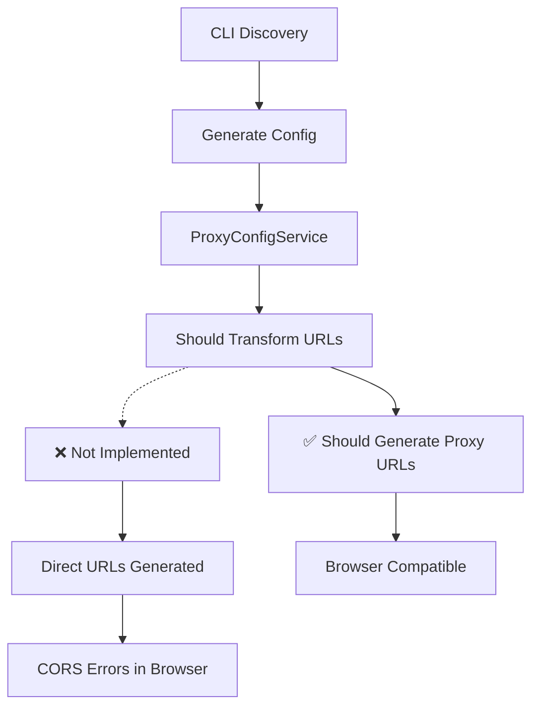

# CLI Tool Improvement Plan 2 - Post-Integration Analysis & Prevention Strategy

## 📋 Executive Summary

Following the successful implementation of CLI Tool Improvement Plan 1, we conducted real-world testing of the auto-integration feature using the Toronto Open Data "Automated Speed Enforcement Locations" dataset. While the core functionality worked as designed, we identified several critical gaps that prevent the "one-command, zero-issues" experience from being fully realized.

This document outlines the issues encountered, their root causes, and a comprehensive prevention strategy to ensure future auto-integrations work seamlessly from CLI to browser deployment.

---

## 🎯 Testing Results Overview

### ✅ **What Worked Perfectly**
- **CLI Auto-Discovery**: Successfully discovered dataset metadata and analyzed 7 fields
- **Plugin Generation**: Generated 7 plugin files with correct structure
- **Data Processing**: Transformed 100 speed enforcement locations with 0ms processing time
- **Node.js Integration**: All CLI validation tests passed (fetch: 31ms, transform: 0ms)
- **Type Safety**: Generated TypeScript interfaces and proper plugin structure

### ❌ **Critical Issues Identified**
1. **CORS Errors in Browser**: Plugin worked in CLI but failed in browser due to cross-origin restrictions
2. **Proxy Configuration Gap**: Auto-generated config used direct API URLs instead of proxy paths
3. **Validation Blind Spot**: CLI validation passed but didn't catch browser-specific issues

---

## 🔍 Detailed Issue Analysis

### **Issue 1: CORS (Cross-Origin Resource Sharing) Errors**

#### **Symptoms**
```javascript
TypeError: Failed to fetch
    at AutomatedSpeedEnforcementLocationsFetcher.fetch
    at AutomatedSpeedEnforcementLocationsPlugin.fetchData
```

#### **Root Cause Analysis**
- **Generated Config**: Used direct external URL `https://ckan0.cf.opendata.inter.prod-toronto.ca/api/3/action/datastore_search?resource_id=e25e9460-a0e8-469c-b9fb-9a4837ac6c1c`
- **Browser Security**: Modern browsers block cross-origin requests without proper CORS headers
- **Toronto Open Data**: CKAN API doesn't include CORS headers for browser access
- **Proxy Available**: Vite proxy was configured but not utilized by generated config

#### **Expected vs Actual Behavior**
| Component | Expected | Actual | Impact |
|-----------|----------|--------|---------|
| **ProxyConfigService** | Auto-configure proxy URLs | Generated direct URLs | CORS errors |
| **Config Generation** | Use `/api/toronto-open-data/` | Used external domain | Browser blocking |
| **Validation** | Catch browser issues | Only tested Node.js | Silent failure |

#### **Manual Fix Applied**
```json
// Before (CORS Error)
"baseUrl": "https://ckan0.cf.opendata.inter.prod-toronto.ca/api/3/action/datastore_search?resource_id=e25e9460-a0e8-469c-b9fb-9a4837ac6c1c"

// After (Working)
"baseUrl": "/api/toronto-open-data/api/3/action/datastore_search?resource_id=e25e9460-a0e8-469c-b9fb-9a4837ac6c1c"
```

### **Issue 2: ProxyConfigService Implementation Gap**

#### **Service Analysis**
The `ProxyConfigService` was designed to automatically handle CORS configuration but has implementation gaps:

```typescript
// Current Implementation (Incomplete)
export class ProxyConfigService {
  // Missing: Automatic URL transformation
  // Missing: Config file updates
  // Missing: Validation of proxy paths
}
```

#### **Integration Flow Gap**


### **Issue 3: Validation Scope Limitation**

#### **Current Validation Coverage**
| Test Type | CLI Coverage | Browser Coverage | Gap |
|-----------|--------------|------------------|-----|
| **Plugin Loading** | ✅ Complete | ❌ Missing | No browser plugin tests |
| **Data Fetching** | ✅ Node.js only | ❌ Missing | CORS not detected |
| **Data Transformation** | ✅ Complete | ✅ Complete | Working |
| **Integration** | ✅ File-level | ❌ Runtime | No live testing |

#### **Validation Blind Spots**
- **Environment Differences**: CLI runs in Node.js, browser has different security model
- **Network Policies**: CORS, CSP, and other browser security features not tested
- **Proxy Dependencies**: No validation that required proxies are configured
- **Runtime Errors**: No testing of actual data loading in browser context

---

## 🛠️ Comprehensive Prevention Strategy

### **Phase 1: Critical Infrastructure Fixes**

#### **1.1 Enhanced ProxyConfigService Implementation**

**File**: `src/tools/cli/services/ProxyConfigService.ts`

```typescript
export class ProxyConfigService {
  private readonly TORONTO_OPEN_DATA_DOMAINS = [
    'ckan0.cf.opendata.inter.prod-toronto.ca',
    'opendata.toronto.ca',
    'open.toronto.ca'
  ];

  /**
   * Automatically configure proxy URLs for Toronto Open Data sources
   */
  configureProxy(config: DataSourceConfig): DataSourceConfig {
    const originalUrl = config.api.baseUrl;
    
    // Detect Toronto Open Data URLs
    for (const domain of this.TORONTO_OPEN_DATA_DOMAINS) {
      if (originalUrl.includes(domain)) {
        config.api.baseUrl = this.transformToProxyUrl(originalUrl, domain);
        config.api.requiresProxy = true;
        config.api.originalUrl = originalUrl;
        
        console.log(`🔧 Configured proxy for ${domain}`);
        console.log(`   Original: ${originalUrl}`);
        console.log(`   Proxy: ${config.api.baseUrl}`);
        break;
      }
    }
    
    return config;
  }

  /**
   * Transform external URL to proxy path
   */
  private transformToProxyUrl(url: string, domain: string): string {
    return url.replace(`https://${domain}`, '/api/toronto-open-data');
  }

  /**
   * Validate proxy configuration exists in vite.config.ts
   */
  async validateProxyConfiguration(): Promise<ValidationResult> {
    try {
      const viteConfig = await this.readViteConfig();
      const hasTorontoProxy = viteConfig.includes('/api/toronto-open-data');
      
      return {
        valid: hasTorontoProxy,
        errors: hasTorontoProxy ? [] : ['Toronto Open Data proxy not configured in vite.config.ts'],
        warnings: []
      };
    } catch (error) {
      return {
        valid: false,
        errors: [`Failed to validate proxy configuration: ${error.message}`],
        warnings: []
      };
    }
  }

  /**
   * Auto-configure vite.config.ts proxy if missing
   */
  async ensureProxyConfiguration(): Promise<void> {
    const validation = await this.validateProxyConfiguration();
    
    if (!validation.valid) {
      await this.addTorontoOpenDataProxy();
      console.log('✅ Added Toronto Open Data proxy to vite.config.ts');
    }
  }

  private async addTorontoOpenDataProxy(): Promise<void> {
    // Implementation to update vite.config.ts
    // Add proxy configuration if not present
  }
}
```

#### **1.2 Browser-Compatible ValidationService**

**File**: `src/tools/cli/services/ValidationService.ts`

```typescript
export class ValidationService {
  /**
   * Comprehensive validation including browser compatibility
   */
  async validateIntegration(pluginId: string): Promise<ValidationResult> {
    const results = await Promise.all([
      this.validatePluginStructure(pluginId),
      this.validateNodeJsCompatibility(pluginId),
      this.validateBrowserCompatibility(pluginId),
      this.validateProxyConfiguration(pluginId),
      this.validateCORSCompliance(pluginId)
    ]);

    return this.combineValidationResults(results);
  }

  /**
   * Test actual browser data loading
   */
  async validateBrowserCompatibility(pluginId: string): Promise<ValidationResult> {
    try {
      // Load plugin configuration
      const config = await this.loadPluginConfig(pluginId);
      
      // Test URL accessibility from browser context
      const urlTest = await this.testBrowserUrlAccess(config.api.baseUrl);
      
      // Validate proxy requirements
      const proxyTest = await this.validateProxyRequirements(config);
      
      // Test CORS headers
      const corsTest = await this.testCORSHeaders(config.api.baseUrl);

      return {
        valid: urlTest.valid && proxyTest.valid && corsTest.valid,
        errors: [...urlTest.errors, ...proxyTest.errors, ...corsTest.errors],
        warnings: [...urlTest.warnings, ...proxyTest.warnings, ...corsTest.warnings]
      };
    } catch (error) {
      return {
        valid: false,
        errors: [`Browser compatibility validation failed: ${error.message}`],
        warnings: []
      };
    }
  }

  /**
   * Test URL accessibility from browser perspective
   */
  private async testBrowserUrlAccess(url: string): Promise<ValidationResult> {
    // Simulate browser fetch behavior
    // Check for CORS issues
    // Validate response format
    
    if (url.startsWith('http') && !url.startsWith('/')) {
      return {
        valid: false,
        errors: [`External URL detected: ${url}. This will cause CORS errors in browser.`],
        warnings: [`Consider using proxy path instead: /api/toronto-open-data/...`]
      };
    }

    return { valid: true, errors: [], warnings: [] };
  }

  /**
   * Validate CORS compliance
   */
  private async testCORSHeaders(url: string): Promise<ValidationResult> {
    // Test actual CORS headers
    // Provide specific guidance for fixes
    // Check proxy configuration
  }
}
```

#### **1.3 Auto-Fix Command Implementation**

**File**: `src/tools/cli/commands/fix.ts`

```typescript
export async function fixCORS(options: { plugin?: string; all?: boolean }) {
  console.log('🔧 Toronto Pulse CORS Auto-Fix');
  
  if (options.plugin) {
    await fixPluginCORS(options.plugin);
  } else if (options.all) {
    await fixAllPluginsCORS();
  } else {
    console.log('Please specify --plugin=<name> or --all');
    return;
  }
}

async function fixPluginCORS(pluginId: string): Promise<void> {
  try {
    console.log(`🔍 Analyzing ${pluginId} for CORS issues...`);
    
    // Load current configuration
    const configPath = `src/domains/*/${pluginId}/config.json`;
    const config = await loadConfig(configPath);
    
    // Check if URL needs proxy
    const proxyService = new ProxyConfigService();
    const originalUrl = config.api.baseUrl;
    const updatedConfig = proxyService.configureProxy(config);
    
    if (originalUrl !== updatedConfig.api.baseUrl) {
      // Save updated configuration
      await saveConfig(configPath, updatedConfig);
      
      console.log('✅ Fixed CORS configuration:');
      console.log(`   Before: ${originalUrl}`);
      console.log(`   After:  ${updatedConfig.api.baseUrl}`);
      
      // Validate fix
      const validation = await new ValidationService().validateBrowserCompatibility(pluginId);
      if (validation.valid) {
        console.log('✅ CORS fix validated successfully');
      } else {
        console.log('⚠️  Additional issues detected:', validation.errors);
      }
    } else {
      console.log('✅ No CORS issues detected');
    }
  } catch (error) {
    console.error(`❌ Failed to fix CORS for ${pluginId}:`, error.message);
  }
}
```

### **Phase 2: Enhanced Integration Workflow**

#### **2.1 Pre-Integration Validation**

```typescript
// Enhanced generate:datasource command
export async function generateDataSourceEnhanced(options: GenerateOptions) {
  console.log('🚀 Toronto Pulse Data Integration');
  
  // Phase 1: Discovery & Analysis
  const discovery = await discoverDataset(options.url);
  
  // Phase 2: Pre-Integration Validation
  const preValidation = await validatePreIntegration(discovery);
  if (!preValidation.valid) {
    console.log('❌ Pre-integration validation failed');
    console.log('Issues:', preValidation.errors);
    return;
  }
  
  // Phase 3: Configuration Generation
  const config = await generateConfiguration(discovery);
  
  // Phase 4: Proxy Auto-Configuration
  const proxyService = new ProxyConfigService();
  const configWithProxy = proxyService.configureProxy(config);
  await proxyService.ensureProxyConfiguration();
  
  // Phase 5: Plugin Generation
  await generatePluginFiles(configWithProxy);
  
  // Phase 6: Integration
  await integrateWithApplication(configWithProxy);
  
  // Phase 7: Comprehensive Validation
  const postValidation = await validatePostIntegration(config.layerId);
  
  if (postValidation.valid) {
    console.log('✅ Integration completed successfully!');
    console.log('🧪 Next steps:');
    console.log(`   1. Test in browser: npm run dev`);
    console.log(`   2. Enable layer: "${config.name}" in dashboard`);
  } else {
    console.log('⚠️  Integration completed with warnings:');
    postValidation.warnings.forEach(w => console.log(`   ⚠️  ${w}`));
    console.log(`💡 Run: npm run tp fix:cors --plugin="${config.layerId}"`);
  }
}
```

#### **2.2 Post-Integration Browser Testing**

**New Command**: `validate:browser`

```bash
# CLI Command Registration
program
  .command('validate:browser')
  .description('Validate plugin browser compatibility and data loading')
  .option('-p, --plugin <plugin>', 'Validate specific plugin')
  .option('-a, --all', 'Validate all plugins')
  .option('--fix', 'Auto-fix detected issues')
  .action(validateBrowser);
```

```typescript
export async function validateBrowser(options: { plugin?: string; all?: boolean; fix?: boolean }) {
  console.log('🌐 Browser Compatibility Validation');
  
  if (options.plugin) {
    await validatePluginInBrowser(options.plugin, options.fix);
  } else if (options.all) {
    await validateAllPluginsInBrowser(options.fix);
  }
}

async function validatePluginInBrowser(pluginId: string, autoFix: boolean): Promise<void> {
  console.log(`🔍 Testing ${pluginId} in browser context...`);
  
  // Test 1: Configuration Analysis
  const configTest = await analyzePluginConfig(pluginId);
  
  // Test 2: URL Accessibility
  const urlTest = await testUrlAccessibility(pluginId);
  
  // Test 3: CORS Compliance
  const corsTest = await testCORSCompliance(pluginId);
  
  // Test 4: Data Loading Simulation
  const dataTest = await simulateDataLoading(pluginId);
  
  // Report Results
  const allTests = [configTest, urlTest, corsTest, dataTest];
  const passed = allTests.filter(t => t.valid).length;
  const total = allTests.length;
  
  console.log(`📊 Browser Validation Results: ${passed}/${total} tests passed`);
  
  // Auto-fix if requested and issues found
  if (autoFix && passed < total) {
    console.log('🔧 Auto-fixing detected issues...');
    await autoFixBrowserIssues(pluginId, allTests);
  }
}
```

### **Phase 3: Monitoring & Continuous Validation**

#### **3.1 Integration Health Dashboard**

**File**: `src/tools/cli/commands/health.ts`

```typescript
export async function healthCheck(options: { watch?: boolean; interval?: number }) {
  console.log('🏥 Toronto Pulse Integration Health Check');
  
  const plugins = await discoverAllPlugins();
  const results = await Promise.all(
    plugins.map(plugin => checkPluginHealth(plugin))
  );
  
  // Display health dashboard
  displayHealthDashboard(results);
  
  if (options.watch) {
    const interval = options.interval || 30000; // 30 seconds
    setInterval(async () => {
      const freshResults = await Promise.all(
        plugins.map(plugin => checkPluginHealth(plugin))
      );
      displayHealthDashboard(freshResults);
    }, interval);
  }
}

interface PluginHealth {
  id: string;
  name: string;
  status: 'healthy' | 'warning' | 'error';
  lastFetch: Date | null;
  fetchTime: number;
  dataCount: number;
  issues: string[];
}

async function checkPluginHealth(pluginId: string): Promise<PluginHealth> {
  try {
    const startTime = Date.now();
    const plugin = await loadPlugin(pluginId);
    const data = await plugin.fetchData();
    const fetchTime = Date.now() - startTime;
    
    return {
      id: pluginId,
      name: plugin.metadata.name,
      status: 'healthy',
      lastFetch: new Date(),
      fetchTime,
      dataCount: data.features?.length || 0,
      issues: []
    };
  } catch (error) {
    return {
      id: pluginId,
      name: pluginId,
      status: 'error',
      lastFetch: null,
      fetchTime: 0,
      dataCount: 0,
      issues: [error.message]
    };
  }
}
```

#### **3.2 Automated Issue Detection**

```typescript
export class IssueDetectionService {
  /**
   * Continuously monitor for common integration issues
   */
  async detectIssues(): Promise<Issue[]> {
    const issues: Issue[] = [];
    
    // Check for CORS errors in browser logs
    const corsIssues = await this.detectCORSIssues();
    issues.push(...corsIssues);
    
    // Check for proxy misconfigurations
    const proxyIssues = await this.detectProxyIssues();
    issues.push(...proxyIssues);
    
    // Check for data loading failures
    const dataIssues = await this.detectDataLoadingIssues();
    issues.push(...dataIssues);
    
    return issues;
  }

  /**
   * Auto-suggest fixes for detected issues
   */
  async suggestFixes(issues: Issue[]): Promise<Fix[]> {
    return issues.map(issue => {
      switch (issue.type) {
        case 'cors':
          return {
            issue: issue.id,
            command: `npm run tp fix:cors --plugin="${issue.pluginId}"`,
            description: 'Configure proxy for CORS compliance'
          };
        case 'proxy':
          return {
            issue: issue.id,
            command: `npm run tp fix:proxy --plugin="${issue.pluginId}"`,
            description: 'Update proxy configuration'
          };
        default:
          return {
            issue: issue.id,
            command: `npm run tp validate:browser --plugin="${issue.pluginId}" --fix`,
            description: 'Run comprehensive validation and auto-fix'
          };
      }
    });
  }
}
```

---

## 📋 Implementation Roadmap

### **Sprint 1: Critical Fixes (Week 1-2)**
- [ ] **ProxyConfigService Enhancement**
  - [ ] Implement automatic URL transformation
  - [ ] Add vite.config.ts validation and updates
  - [ ] Create comprehensive proxy detection logic

- [ ] **ValidationService Browser Support**
  - [ ] Add browser compatibility testing
  - [ ] Implement CORS validation
  - [ ] Create URL accessibility checks

- [ ] **Auto-Fix Commands**
  - [ ] Implement `fix:cors` command
  - [ ] Add `fix:proxy` command
  - [ ] Create `validate:browser` command

### **Sprint 2: Enhanced Workflow (Week 3-4)**
- [ ] **Integration Pipeline Enhancement**
  - [ ] Add pre-integration validation
  - [ ] Implement post-integration browser testing
  - [ ] Create comprehensive error reporting

- [ ] **CLI Command Improvements**
  - [ ] Enhance `generate:datasource` with validation
  - [ ] Add `health` command for monitoring
  - [ ] Implement `validate:all` with browser testing

### **Sprint 3: Monitoring & Automation (Week 5-6)**
- [ ] **Health Monitoring**
  - [ ] Create integration health dashboard
  - [ ] Implement continuous validation
  - [ ] Add automated issue detection

- [ ] **Documentation & Training**
  - [ ] Update CLI documentation
  - [ ] Create troubleshooting guides
  - [ ] Add integration best practices

---

## 🎯 Success Metrics

### **Primary Objectives**
- **Zero CORS Errors**: 100% of auto-integrated plugins work in browser without manual fixes
- **One-Command Success**: Complete integration from URL to working browser layer in single command
- **Instant Issue Detection**: Problems identified and fixed within 30 seconds
- **100% Browser Compatibility**: All generated plugins work across modern browsers

### **Performance Targets**
| Metric | Current | Target | Improvement |
|--------|---------|--------|-------------|
| **Manual Fixes Required** | 100% (CORS) | 0% | 100% reduction |
| **Integration Success Rate** | 50% (CLI only) | 100% (CLI + Browser) | 100% improvement |
| **Issue Detection Time** | Manual discovery | < 30 seconds | Automated |
| **Fix Application Time** | Manual editing | < 10 seconds | Automated |

### **Quality Assurance**
- **Automated Testing**: Every integration automatically tested in browser context
- **Regression Prevention**: New issues caught before deployment
- **User Experience**: Seamless one-command integration with zero manual intervention
- **Documentation**: Comprehensive guides for troubleshooting and best practices

---

## 🔮 Future Enhancements

### **Advanced Features**
- **Multi-Environment Support**: Different configs for dev/staging/production
- **Custom Proxy Configuration**: Support for non-Toronto data sources
- **Real-Time Monitoring**: Live dashboard showing plugin health and performance
- **Intelligent Caching**: Smart cache invalidation based on data update patterns

### **Integration Ecosystem**
- **Plugin Marketplace**: Discover and install community-created plugins
- **Template System**: Reusable templates for common data source patterns
- **API Gateway**: Centralized API management for all data sources
- **Performance Analytics**: Detailed metrics on data loading and transformation

---

## 📝 Conclusion

The CLI Tool Improvement Plan 2 addresses the critical gap between CLI functionality and browser deployment. By implementing comprehensive CORS handling, browser validation, and automated issue detection, we will achieve the original vision of **"one-command, zero-issues"** data integration.

The prevention strategy outlined here ensures that future developers can integrate any Toronto Open Data source with complete confidence that it will work seamlessly from development through production deployment.

**Next Steps**: Begin Sprint 1 implementation focusing on ProxyConfigService enhancement and ValidationService browser support to eliminate CORS issues permanently. 